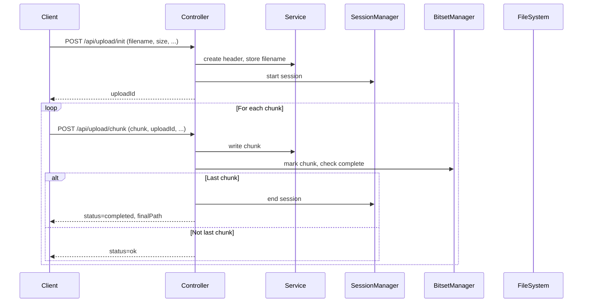
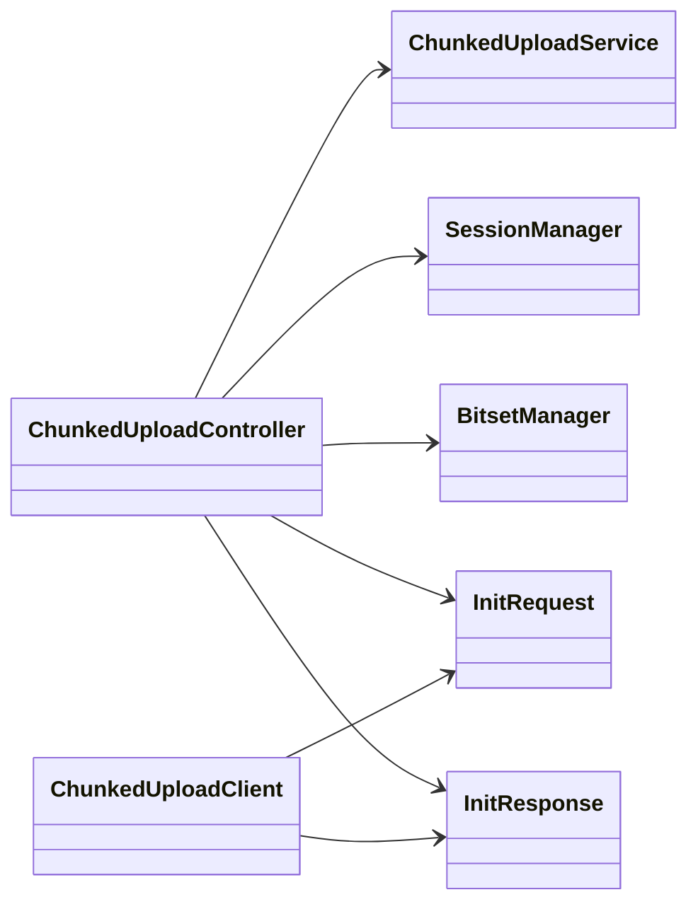

# Chunked Upload Service

This project implements a resumable file upload service in Java (Spring Boot). The project is divided into three modules:
- `server`: The main Spring Boot application providing the upload API.
- `client`: A Java client for interacting with the upload service.
- `model`: Shared data transfer objects (DTOs) used by both the server and client.

## Features
- Chunked upload with resume support
- File header to track uploaded chunks
- Resumable uploads without a database
- Simple cache directory for in-progress and completed uploads
- JUnit tests for both unit and integration testing
- Modular architecture: `server`, `client`, and `model` modules

## Gradle Project Structure
The project uses a multi-module Gradle setup. The root `build.gradle` file configures shared settings for the subprojects: `server`, `client`, and `model`. Dependency versions are managed centrally using the `io.spring.dependency-management` plugin and the Spring Boot BOM, ensuring consistency across all modules.

**Logging:**
SLF4J logging is used throughout the project, with Logback as the backend.
Logback configuration is provided in [`server/src/main/resources/logback.xml`](server/src/main/resources/logback.xml:1).
Logback and SLF4J dependencies are managed by Spring Boot; do not declare explicit Logback versions in Gradle.

Each module (`server`, `client`, `model`) has its own `build.gradle` file defining its specific dependencies.

## Directory Structure
* Upload directories are configurable in `application.properties` within the `server` module:
    - `chunkedupload.inprogress-dir`: Temporary storage for in-progress uploads (default: `uploads/in-progress`)
    - `chunkedupload.complete-dir`: Final assembled files (default: `uploads/complete`), named as `<uploadId>_<originalFilename>`

### Release Artifacts Structure
Each release zip contains:
- `libs/chunked-upload-*.jar`
- `dependencies/download-dependencies.bat`
- `dependencies/download-dependencies.sh`
- `run-*.bat`
- `run-*.sh`

See `.github/workflows/build-and-release.yml` for packaging details.

## API Endpoints

### 1. `POST /api/upload/init`
**Request Body:**
```json
{
  "totalChunks": 2,
  "chunkSize": 10,
  "fileSize": 20,
  "filename": "myfile.txt"
}
```
**Response:**
```json
{
  "uploadId": "...",
  "totalChunks": 2,
  "chunkSize": 10,
  "fileSize": 20,
  "filename": "myfile.txt"
}
```

### 2. `POST /api/upload/chunk`
**Form Data:**
- `uploadId`, `chunkNumber`, `totalChunks`, `chunkSize`, `fileSize`, `file` (chunk data)
- On the last chunk, the server assembles the file as `<uploadId>_<filename>` in `uploads/complete/`.

### 3. `GET /api/upload/{uploadId}/status`
Returns the status of an ongoing upload.

### 4. `DELETE /api/upload/{uploadId}`
Aborts and cleans up an in-progress upload.

## Sequence Diagram



## Class Diagram



## Build & Run

```bash
# Clean and build all modules
./gradlew clean build

# Run the server application
./gradlew :server:bootRun

# Run the client's integration tests
./gradlew :client:test
```
