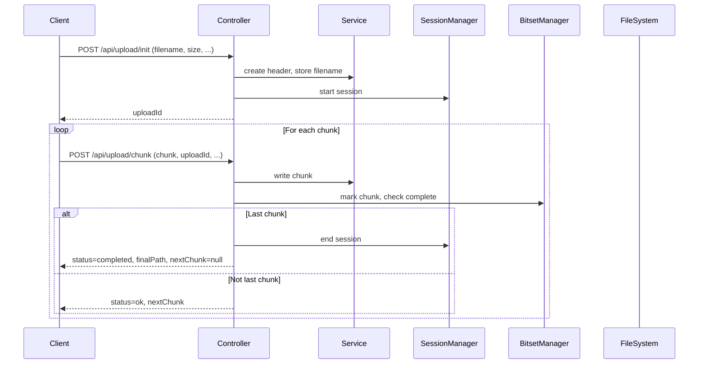
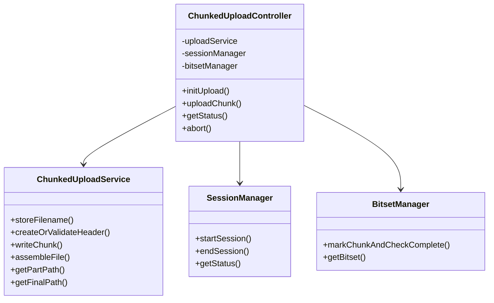

# Chunked Upload Service

This project implements a resumable file upload server in Java (Spring Boot) with a modular architecture. It stores file chunks and maintains a simple header file to track uploaded chunks, using a dedicated directory structure for in-progress and completed uploads.

## Client Implementation Update
- The Java client (`ChunkedUploadClient`) no longer calls an explicit assemble/merge endpoint after uploading all chunks. The server automatically assembles the file once all chunks are received.
- The client uploads all chunks in parallel using worker threads and a blocking queue, with robust error propagation and retry logic.
- The API and server behavior remain unchanged: the server assembles the file as soon as all chunks are present.

## Features
- Chunked upload with resume support
- File header to track uploaded chunks
- Resumable uploads without database
- Simple cache directory
- JUnit tests
- Original filename is required and preserved for completed uploads
- Modular architecture: controller, service, session manager, bitset manager

## Directory Structure
- `uploads/in-progress/`: Temporary storage for in-progress uploads (chunk data and header)
- `uploads/complete/`: Final assembled files, named as `<uploadId>_<originalFilename>`

## API Endpoints

### 1. `POST /api/upload/init`
**Request Body:**
```json
{
  "totalChunks": 2,
  "chunkSize": 10,
  "fileSize": 20,
  "filename": "myfile.txt"
}
```
**Response:**
```json
{
  "uploadId": "...",
  "totalChunks": 2,
  "chunkSize": 10,
  "fileSize": 20,
  "filename": "myfile.txt"
}
```

### 2. `POST /api/upload/chunk`
**Form Data:**
- `uploadId`, `chunkNumber`, `totalChunks`, `chunkSize`, `fileSize`, `chunkChecksum`, `file` (chunk data)
- On last chunk, server assembles the file as `<uploadId>_<filename>` in `uploads/complete/`
- Response always includes `nextChunk` (null if completed)

### 3. `GET /api/upload/{uploadId}/status`
Returns upload status and chunk progress.

### 4. `DELETE /api/upload/{uploadId}`
Aborts and cleans up an in-progress upload.

## Sequence Diagram



## Class Diagram



## Implementation Notes
- The original filename is required in the `/init` API and is used for the final assembled file.
- All chunk and session management is in-memory and file-based (no database).
- The service is robust for resumable and concurrent uploads.
- Controller, service, and helper classes are all ≤100 lines, methods ≤20 lines for maintainability.

## Build & Run
```bash
./gradlew build
./gradlew run
