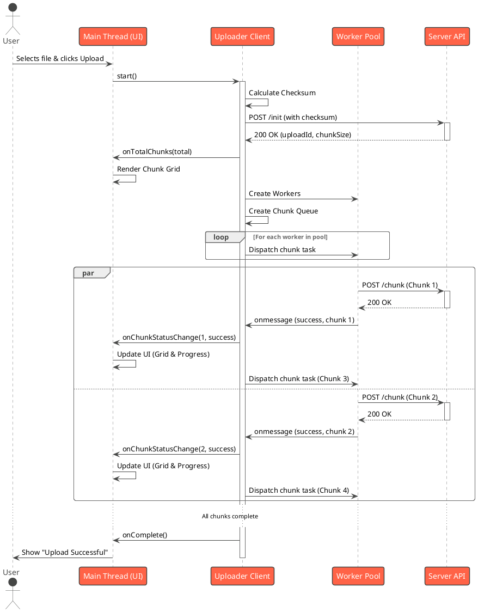

<!-- This file has been updated to include all API endpoints. -->
# User Guide

This guide provides step-by-step instructions for building, running, and interacting with the Chunked File Upload System.

## 1. Prerequisites

- Java JDK 17 or later
- An internet connection (for downloading Gradle dependencies)

## 2. Building the Project

The entire project can be built from the root directory using the Gradle wrapper. This command will compile all modules, run the unit tests, and create the necessary JAR files.

**On Windows:**
```sh
.\gradlew.bat clean build
```

**On macOS/Linux:**
```sh
./gradlew clean build
```

## 3. Running the Server

The Spring Boot server must be running for any of the clients to work.

1.  Navigate to the `server` directory:
    ```sh
    cd server
    ```
2.  Run the server using the `bootRun` Gradle task:
    ```sh
    ..\gradlew.bat bootRun
    ```
    (or `./gradlew bootRun` on macOS/Linux)

The server will start on `http://localhost:8080`.

## 4. API Endpoint Documentation

The server exposes a REST API for the chunked upload process.

### `POST /api/upload/init`

Initializes a new upload session. The server creates a temporary file and returns a unique `uploadId`.

**cURL Example:**
```sh
curl -X POST http://localhost:8080/api/upload/init \
-u user1:password \
-H "Content-Type: application/json" \
-d '{"filename": "my-large-file.zip", "fileSize": 104857600, "checksum": "a1b2c3d4..."}'
```

### `POST /api/upload/chunk`

Uploads a single chunk of the file.

**cURL Example:**
```sh
# Note: You need to have the file chunk saved as a separate file (e.g., chunk0.part) to use with curl's -F flag.
curl -X POST http://localhost:8080/api/upload/chunk \
-u user1:password \
-F "uploadId=a1b2c3d4-e5f6-7890-1234-567890abcdef" \
-F "chunkNumber=0" \
-F "file=@/path/to/your/chunk0.part"
```

### `GET /api/users`

Retrieves a list of all tenant accounts in the system.

**cURL Example:**
```sh
curl -X GET http://localhost:8080/api/users -u user1:password
```

### `GET /api/upload/{uploadId}/status`

Checks the status of an ongoing upload. This can be used to see if an upload session is still active.

**cURL Example:**
```sh
curl -X GET http://localhost:8080/api/upload/a1b2c3d4-e5f6-7890-1234-567890abcdef/status -u user1:password
```

**Response:** A `200 OK` with a string message indicating the status.

### `DELETE /api/upload/{uploadId}`

Aborts and deletes an in-progress upload. This will remove the temporary part file and any associated database records.

**cURL Example:**
```sh
curl -X DELETE http://localhost:8080/api/upload/a1b2c3d4-e5f6-7890-1234-567890abcdef -u user1:password
```

**Response:** A `204 No Content` status on success.

## 5. Running the Clients

There are three different clients available. For each, open a new terminal window.

### a) Java Client (Command Line)

1.  Navigate to the `client` directory.
2.  Run the `run` task via Gradle, passing the file path and credentials as arguments:
    ```sh
    ..\gradlew.bat run --args="--filePath=C:\path\to\your\file.zip --uploadUrl=http://localhost:8080/api/upload --username=user1 --password=password"
    ```

### b) JavaScript Client (JVM via GraalVM)

1.  Navigate to the `js-client` directory.
2.  Run the `run` task via Gradle:
    ```sh
    ..\gradlew.bat run --args="--filePath=C:\path\to\your\file.zip --uploadUrl=http://localhost:8080/api/upload --username=user1 --password=password"
    ```

### c) Browser-Native Client (Concurrent)

This is the most advanced client, running entirely in a web browser and using Web Workers for concurrent uploads.

1.  Open the `index.html` file from the `browser-client` directory in a modern web browser.
2.  The page will automatically fetch the list of available users.
3.  Select a user, choose a file, and click "Upload".

#### Concurrent Upload Sequence Diagram

This diagram illustrates how the browser client uses Web Workers to upload multiple chunks in parallel.


