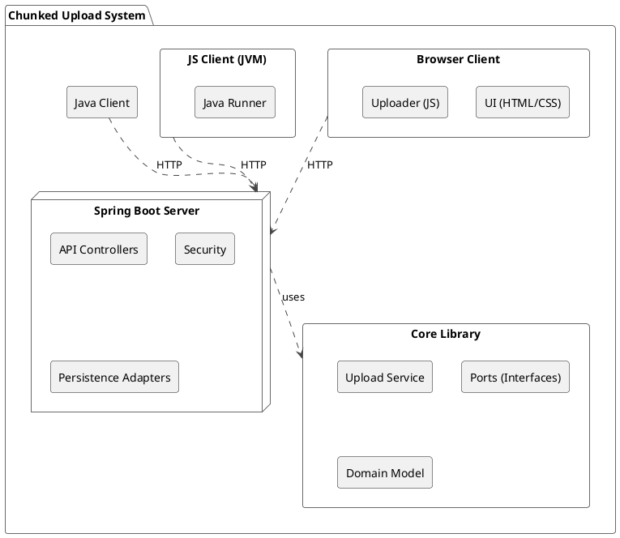

<!-- Force update to ensure documentation is current -->
# System Architecture

This document provides a detailed overview of the architectural design of the Chunked File Upload System. The system is designed to be modular, scalable, and maintainable, with a clear separation of concerns between its different parts.

## 1. Current Refactored Architecture

The system has been refactored into a multi-module project with a clean, decoupled architecture. This design promotes a strong separation of concerns, allowing for independent development and testing of the core business logic, the server application, and the various clients.



### Core Module: The Hexagon

The most important architectural decision is the decoupling of the core business logic from external frameworks. This is achieved using the **Ports and Adapters (Hexagonal) Architecture**.

- The **`:core`** module is the **hexagon**. It contains the pure business logic (`AbstractChunkedUpload`) and defines the interfaces (the **Ports**) it needs to communicate with the outside world (e.g., for data persistence).
- The **`:server`** module provides the **adapters**. It contains the concrete implementations of the Port interfaces, using technologies like Spring Data JPA.

This design means the core logic can be tested in isolation, and the underlying technologies (like databases) can be swapped without affecting the business rules.

### Class Diagram: Ports and Adapters

This diagram illustrates how the `core` module defines the `IUploadInfoPort` and `ITenantAccountPort` interfaces, and how the `server` module provides the JPA-based implementations.

```plantuml
@startuml
!theme vibrant
skinparam classAttributeIconSize 0

package "core" {
  interface IUploadInfoPort
  interface ITenantAccountPort

  class AbstractChunkedUpload {
    + iUploadInfoPort: IUploadInfoPort
    + iTenantAccountPort: ITenantAccountPort
    + writeChunk()
    + assembleFile()
  }

  AbstractChunkedUpload o-- IUploadInfoPort
  AbstractChunkedUpload o-- ITenantAccountPort
}

package "server" {
  class UploadInfoRepository <<JPA>>
  class TenantAccountRepository <<JPA>>

  class JpaUploadInfoAdapter implements IUploadInfoPort {
    - uploadInfoRepository: UploadInfoRepository
  }

  class JpaTenantAccountAdapter implements ITenantAccountPort {
    - tenantAccountRepository: TenantAccountRepository
  }

  class ChunkedUploadService extends AbstractChunkedUpload {
    // Spring-specific implementation
  }

  JpaUploadInfoAdapter .> UploadInfoRepository
  JpaTenantAccountAdapter .> TenantAccountRepository
  ChunkedUploadService -up-|> AbstractChunkedUpload
}

note right of AbstractChunkedUpload
  The core business logic is completely
  decoupled from the persistence layer.
  It depends only on interfaces (Ports).
end note

note left of JpaUploadInfoAdapter
  The server module provides the
  concrete implementations (Adapters)
  of the Ports using Spring Data JPA.
end note
@enduml
```

## 2. Original Architecture Details

*This section describes the original implementation details that are still relevant.*

### Server Module Internals

The `:server` module is responsible for handling all web-layer concerns.

#### a) API Controllers

- **`ChunkedUploadController`**: The primary controller for the upload process. It handles the `/api/upload` endpoints for initializing an upload (`/init`) and receiving file chunks (`/chunk`). It delegates all business logic to the `ChunkedUploadService` from the `:core` module.
- **`UserController`**: A simple controller that exposes the `/api/users` endpoint. This is used by the browser client to populate the user selection dropdown.

#### b) Security Configuration

- **`SecurityConfig.java`**: This class configures Spring Security to secure the API endpoints.
  - It uses **HTTP Basic Authentication**.
  - It provides a `UserDetailsService` bean that integrates with the `TenantAccountRepository` to authenticate users against the database.
  - It configures a global **CORS (Cross-Origin Resource Sharing)** policy to allow the browser client to make requests to the server.
  - **CSRF (Cross-Site Request Forgery) protection is disabled**, which is a common practice for stateless REST APIs consumed by non-browser clients or single-page applications.

#### c) Persistence Layer (Adapters)

- **JPA Entities**: The `TenantAccount` and `UploadInfo` classes in the `:server` module are JPA entities that map to the database tables.
- **Spring Data Repositories**: The `TenantAccountRepository` and `UploadInfoRepository` are standard Spring Data JPA interfaces that provide basic CRUD operations.
- **Port Adapters**: The `JpaTenantAccountAdapter` and `JpaUploadInfoAdapter` are the concrete implementations of the Port interfaces defined in the `:core` module. They bridge the gap between the core business logic and the Spring Data persistence layer.
